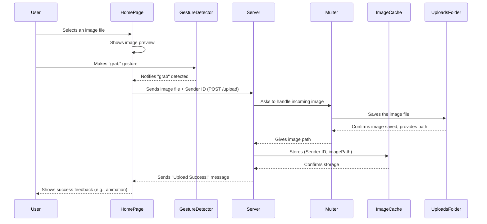
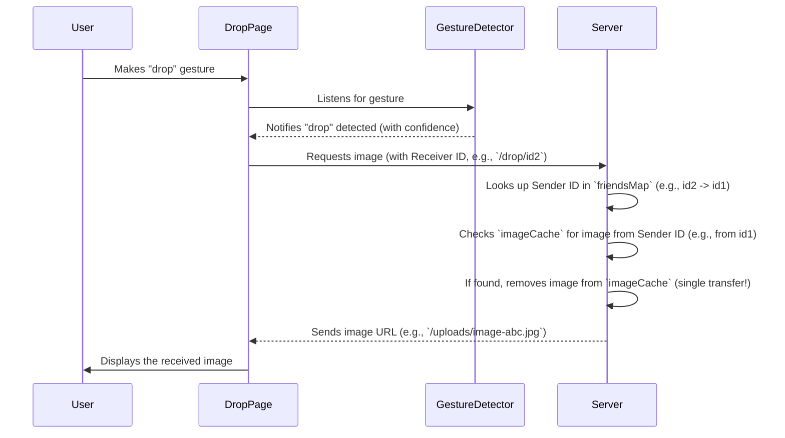

# Easy Drop: Air Gesture Image Transfer ✋📸

**Easy Drop** is a web application inspired by Huawei's Air Gesture feature that enables users to transfer images between devices using hand gestures detected via webcam. Built with **React**, **Express**, and **ml5.js (Teachable Machine)**, the project demonstrates real-time gesture recognition and seamless image sharing.

---

## Features

* **Gesture-based Image Transfer:** Upload and send images using **GRAB** and **DROP** hand gestures.
* **Real-time Webcam Detection:** Uses Teachable Machine and ml5.js for gesture classification.
* **Two-User Demo Flow:** Simulates sender and receiver with unique user IDs.
* **Modern UI:** Responsive interface with smooth animations and real-time feedback.

---


### Full Flow: Grab




### Full Flow: Drop

---

## Getting Started (Local Setup)

### Prerequisites

* Node.js (v16+ recommended)
* npm or yarn

### Clone the Repository

```bash
git clone https://github.com/arc-ch/easy-drop.git
cd easy-drop
```

### Install Dependencies

#### Client

```bash
cd client
npm install
```

#### Server

```bash
cd ../server
npm install
```

### Run Locally

#### Start the Server

```bash
npm start
# or
node index.js
```

Server runs on: [http://localhost:5000](http://localhost:5000)

#### Start the Client

```bash
cd ../client
npm run dev
```

Client runs on: [http://localhost:5173](http://localhost:5173)

---

## Deployment

### Client (Netlify)

* Build command: `npm run build`
* Publish directory: `dist`

### Server (Render)

* Root directory: `server`
* Build command: `npm install`
* Start command: `node index.js`
* Environment variable:

  ```
  PORT=5000
  ```

> **Note:** Update `API_URL` in the client to your deployed backend URL.

---

## Usage

1. Open Easy Drop in your browser.
2. Select an image and perform a **GRAB** gesture to upload.
3. Open the Drop page (or a second device/browser).
4. Perform a **DROP** gesture to receive the image.
5. Demo users:

   * `id1` → Sender
   * `id2` → Receiver

---

## Technical Details

* **Frontend:** React, Vite, Tailwind CSS, ml5.js
* **Backend:** Express.js, Multer, CORS
* **ML Model:** Google Teachable Machine
* **APIs:**

  * `POST /upload`
  * `GET /drop/:receiverId`

### Folder Structure

```
client/
server/
```

---

## License

MIT License

---
